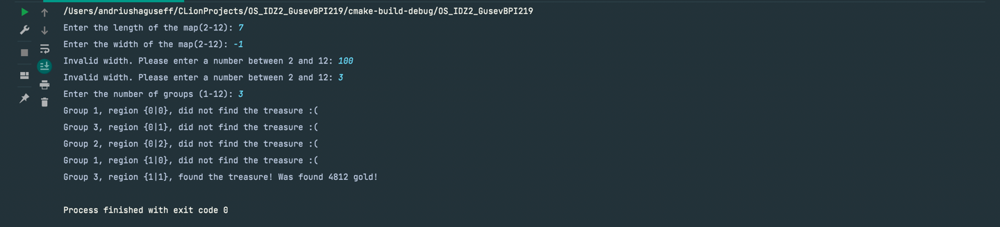
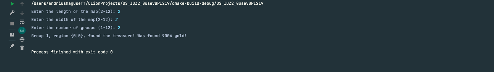
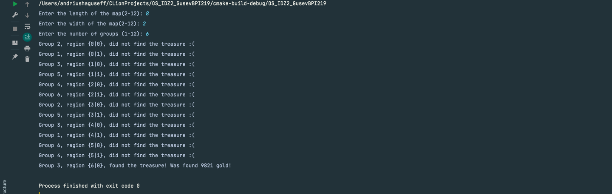
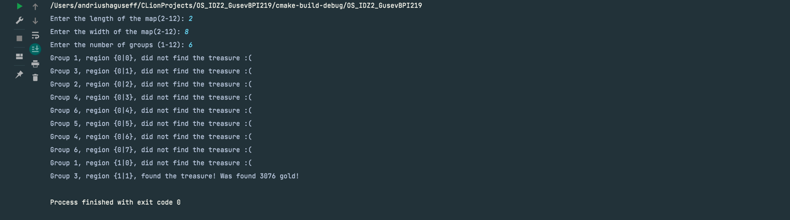
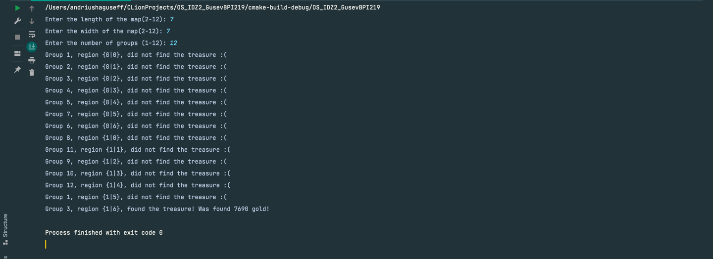
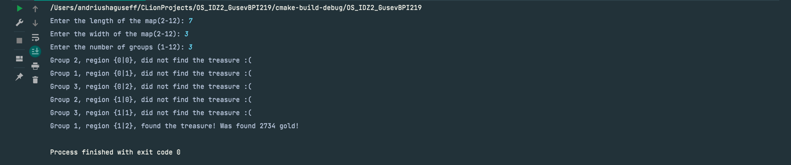
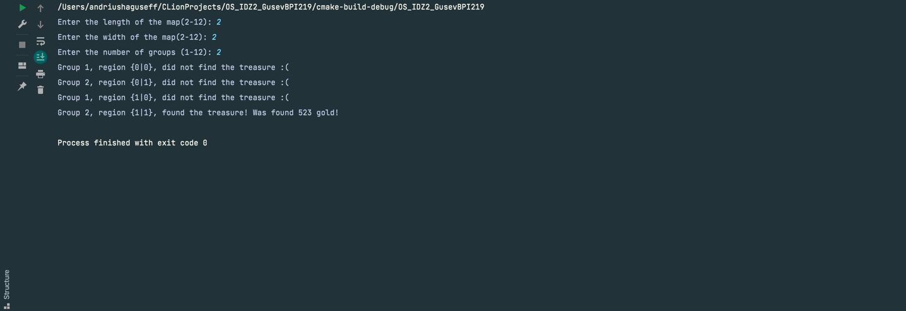
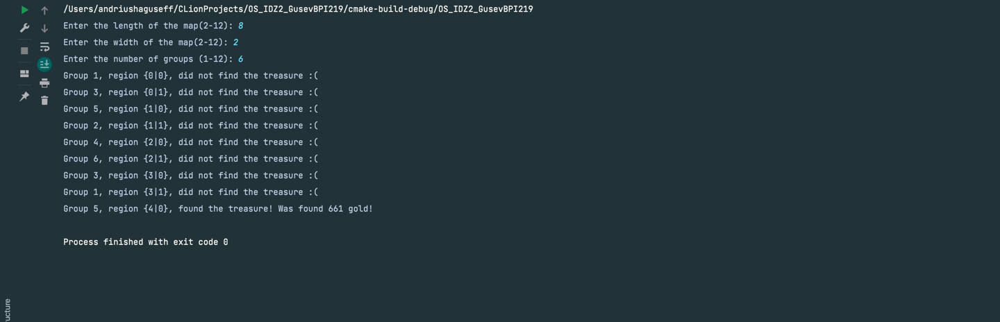
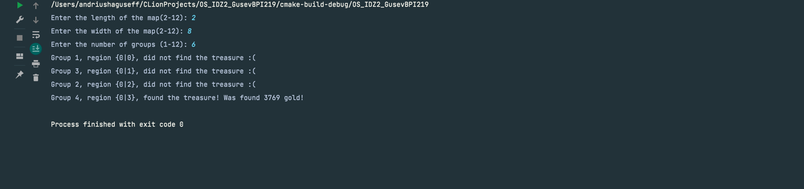

# # Домашнее задание по ОС #2
###Гусев Андрей Вадимович БПИ219 - Вариант 31
- ### **Вариант:**
    Вариант 31. Первая задача об Острове Сокровищ. Шайка пиратов под предводительством Джона Сильвера высадилась на берег Острова Сокровищ.Несмотря на добытую карту старого Флинта, местоположение сокровищ по-прежнему остается загадкой, поэтому искать клад приходится практически на ощупь. Так как Сильвер ходит на деревянной ноге,то самому бродить по джунглям ему не с руки. Джон Сильвер поделил остров научастки, а пиратов на небольшие группы. Каждой группе поручается искать клад на одном из участков, а сам Сильвер ждет на берегу. Пираты, обшарив участок, возвращаются к Сильверу и докладывают о результатах. Если клад не найден,то пираты назначаются на другой участок. Требуется создать приложение, моделирующее действия Сильвера и пиратов. Примечание. Количество участков превышает число поисковых групп. Сильвер и каждая группа пиратов задаются соответствующими процессами..<br>
- ### **Суть решения (как я понял, что придумал, как реализовал)**
    Остров - это прямоугольник размеры которого вводятся с клавиатуры. Местонахождение и количество золота неизвестно - оно генерируется автоматически. Джон Сильвер - главный процесс, он ждёт, когда дочерние процессы-команды закончат исследовать свою часть острова(клетку), чтобы далее выдать новый участок поиска для каждой группы (дочернего процесса). Когда какая-то из групп находит клад, дальнейший поиск клада прекращается. На самом деле участки острова не одинаковые по площади, поэтому каждая группа тратит от одной до трех секунд на исследование участка. (Так как размеры острова и количество групп вводятся с клавиатуры - можно ввести количество групп, превышающее количество участков(len * wid) на острове - в этом нет ничего страшного и ничего не сломается)

##Кратко по коду:
```c
struct Island;  //Структура моделирующая остров

void initialize_island_struct(struct Island* s, int length, int width);  // Инициализация острова

void initialize_data(struct Island* data, int length, int width);  // Тут генерируется местонахождение и размер клада

void initialize_child_process(int group, int sem_read, int sem_write, struct Island *data);  // Тут происходит инициализация и работа дочерних процессов (поисковые группы)

void parent_process(int sem_read, int sem_write, int width, struct Island *data);  // Тут происходит работа родительского процесса (Капитан Флинт)

void handle_sigint(int sig);  // Обработка команды {ctrl+c}/преждевременный выход из программы

int main(int argc, char **argv);  // Функция main - тут происходит ввод данных острова и количества поисковых групп, также тут происходит сама реализация метода из критерия 
```

## 4 бала
- Использовались семафоры UNIX SYSTEM V, разделяемая память в стандарте UNIX SYSTEM V. Программа запускается одним исполняемым файлом, ввод данных вводится с помощью консоли - аргументы командной строки не используются.
###Тесты:





## 5 баллов
- Использовались именованные семафоры Posix, разделяемая память в стандарте Posix. Программа запускается одним исполняемым файлом, ввод данных вводится с помощью консоли - аргументы командной строки не используются.
###Тесты:




Пятый тест оказался слишком большим:
```
Enter the length of the map(2-12): 12
Enter the width of the map(2-12): 12
Enter the number of groups (1-12): 12
Group 3, region {0|0}, did not find the treasure :(
Group 5, region {0|1}, did not find the treasure :(
Group 1, region {0|2}, did not find the treasure :(
Group 2, region {0|3}, did not find the treasure :(
Group 4, region {0|4}, did not find the treasure :(
Group 6, region {0|5}, did not find the treasure :(
Group 7, region {0|6}, did not find the treasure :(
Group 8, region {0|7}, did not find the treasure :(
Group 9, region {0|8}, did not find the treasure :(
Group 10, region {0|9}, did not find the treasure :(
Group 11, region {0|10}, did not find the treasure :(
Group 12, region {0|11}, did not find the treasure :(
Group 3, region {1|0}, did not find the treasure :(
Group 4, region {1|1}, did not find the treasure :(
Group 6, region {1|2}, did not find the treasure :(
Group 2, region {1|3}, did not find the treasure :(
Group 5, region {1|4}, did not find the treasure :(
Group 1, region {1|5}, did not find the treasure :(
Group 7, region {1|6}, did not find the treasure :(
Group 8, region {1|7}, did not find the treasure :(
Group 9, region {1|8}, did not find the treasure :(
Group 10, region {1|9}, did not find the treasure :(
Group 11, region {1|10}, did not find the treasure :(
Group 12, region {1|11}, did not find the treasure :(
Group 5, region {2|0}, did not find the treasure :(
Group 3, region {2|1}, did not find the treasure :(
Group 1, region {2|2}, did not find the treasure :(
Group 4, region {2|3}, did not find the treasure :(
Group 6, region {2|4}, did not find the treasure :(
Group 2, region {2|5}, did not find the treasure :(
Group 7, region {2|6}, did not find the treasure :(
Group 10, region {2|7}, did not find the treasure :(
Group 8, region {2|8}, did not find the treasure :(
Group 9, region {2|9}, did not find the treasure :(
Group 11, region {2|10}, did not find the treasure :(
Group 12, region {2|11}, did not find the treasure :(
Group 3, region {3|0}, did not find the treasure :(
Group 5, region {3|1}, did not find the treasure :(
Group 1, region {3|2}, did not find the treasure :(
Group 4, region {3|3}, did not find the treasure :(
Group 6, region {3|4}, did not find the treasure :(
Group 7, region {3|5}, did not find the treasure :(
Group 2, region {3|6}, did not find the treasure :(
Group 10, region {3|7}, did not find the treasure :(
Group 9, region {3|8}, did not find the treasure :(
Group 11, region {3|9}, did not find the treasure :(
Group 8, region {3|10}, did not find the treasure :(
Group 12, region {3|11}, did not find the treasure :(
Group 3, region {4|0}, did not find the treasure :(
Group 5, region {4|1}, did not find the treasure :(
Group 1, region {4|2}, did not find the treasure :(
Group 4, region {4|3}, did not find the treasure :(
Group 6, region {4|4}, did not find the treasure :(
Group 7, region {4|5}, did not find the treasure :(
Group 2, region {4|6}, did not find the treasure :(
Group 10, region {4|7}, did not find the treasure :(
Group 9, region {4|8}, did not find the treasure :(
Group 11, region {4|9}, did not find the treasure :(
Group 8, region {4|10}, did not find the treasure :(
Group 12, region {4|11}, did not find the treasure :(
Group 3, region {5|0}, did not find the treasure :(
Group 5, region {5|1}, did not find the treasure :(
Group 4, region {5|2}, did not find the treasure :(
Group 1, region {5|3}, did not find the treasure :(
Group 6, region {5|4}, did not find the treasure :(
Group 7, region {5|5}, did not find the treasure :(
Group 2, region {5|6}, did not find the treasure :(
Group 10, region {5|7}, did not find the treasure :(
Group 11, region {5|8}, did not find the treasure :(
Group 9, region {5|9}, did not find the treasure :(
Group 8, region {5|10}, did not find the treasure :(
Group 12, region {5|11}, did not find the treasure :(
Group 3, region {6|0}, did not find the treasure :(
Group 4, region {6|1}, did not find the treasure :(
Group 1, region {6|2}, did not find the treasure :(
Group 5, region {6|3}, did not find the treasure :(
Group 10, region {6|4}, did not find the treasure :(
Group 11, region {6|5}, did not find the treasure :(
Group 6, region {6|6}, did not find the treasure :(
Group 7, region {6|7}, did not find the treasure :(
Group 2, region {6|8}, did not find the treasure :(
Group 9, region {6|9}, did not find the treasure :(
Group 8, region {6|10}, did not find the treasure :(
Group 12, region {6|11}, did not find the treasure :(
Group 3, region {7|0}, did not find the treasure :(
Group 4, region {7|1}, did not find the treasure :(
Group 5, region {7|2}, did not find the treasure :(
Group 10, region {7|3}, did not find the treasure :(
Group 11, region {7|4}, did not find the treasure :(
Group 1, region {7|5}, did not find the treasure :(
Group 6, region {7|6}, did not find the treasure :(
Group 7, region {7|7}, did not find the treasure :(
Group 2, region {7|8}, did not find the treasure :(
Group 9, region {7|9}, did not find the treasure :(
Group 8, region {7|10}, did not find the treasure :(
Group 12, region {7|11}, did not find the treasure :(
Group 3, region {8|0}, did not find the treasure :(
Group 11, region {8|1}, did not find the treasure :(
Group 5, region {8|2}, did not find the treasure :(
Group 4, region {8|3}, did not find the treasure :(
Group 1, region {8|4}, did not find the treasure :(
Group 10, region {8|5}, did not find the treasure :(
Group 6, region {8|6}, did not find the treasure :(
Group 7, region {8|7}, did not find the treasure :(
Group 2, region {8|8}, did not find the treasure :(
Group 9, region {8|9}, did not find the treasure :(
Group 12, region {8|10}, did not find the treasure :(
Group 8, region {8|11}, did not find the treasure :(
Group 3, region {9|0}, did not find the treasure :(
Group 11, region {9|1}, did not find the treasure :(
Group 10, region {9|2}, did not find the treasure :(
Group 4, region {9|3}, did not find the treasure :(
Group 1, region {9|4}, did not find the treasure :(
Group 5, region {9|5}, did not find the treasure :(
Group 7, region {9|6}, did not find the treasure :(
Group 2, region {9|7}, did not find the treasure :(
Group 9, region {9|8}, did not find the treasure :(
Group 6, region {9|9}, did not find the treasure :(
Group 8, region {9|10}, did not find the treasure :(
Group 12, region {9|11}, found the treasure! Was found 5258 gold!
```